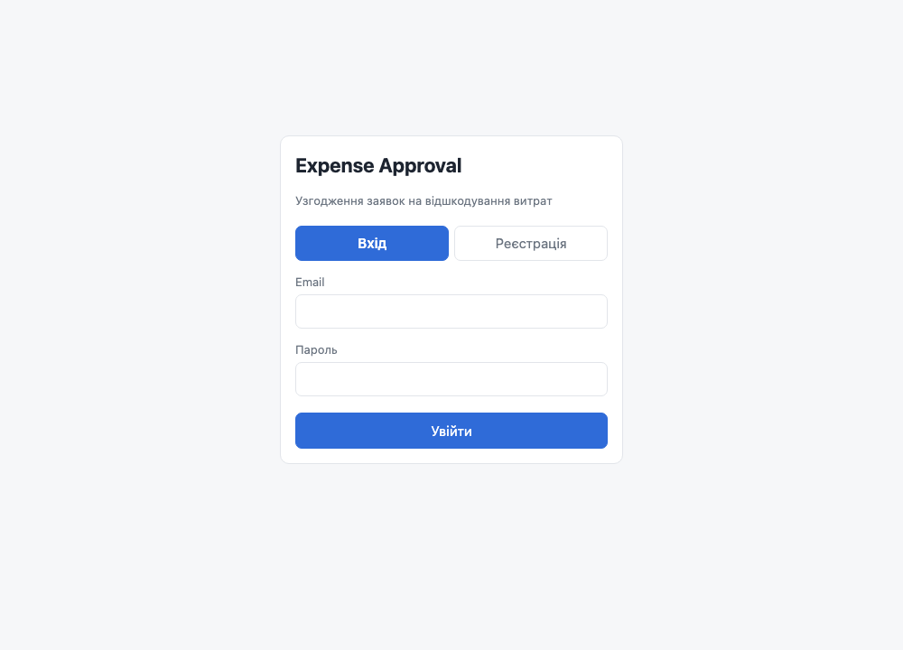
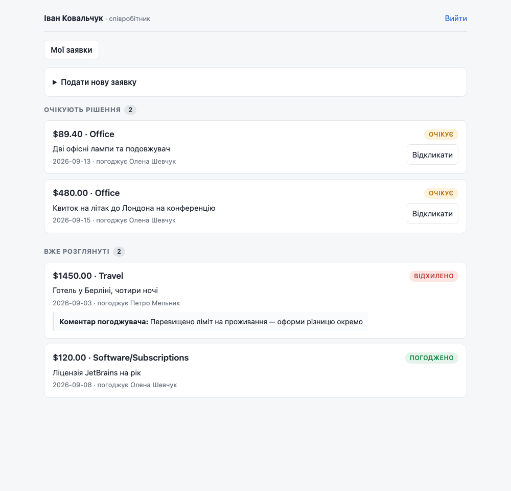
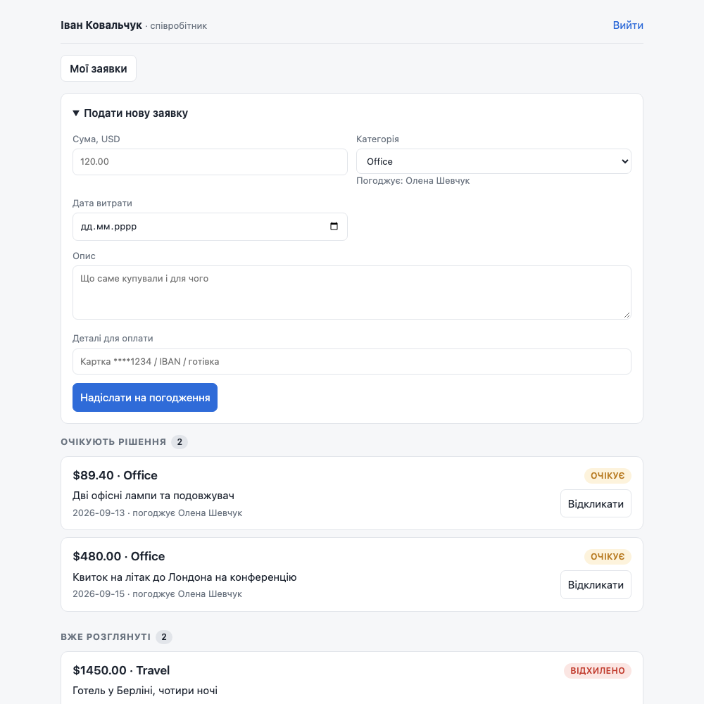
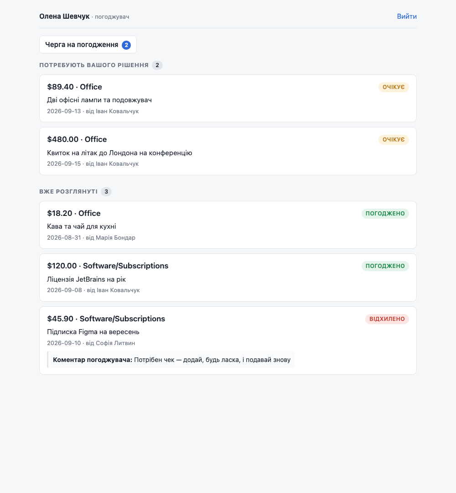
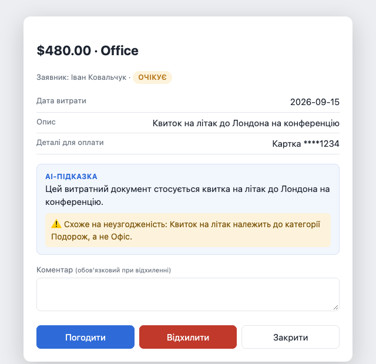
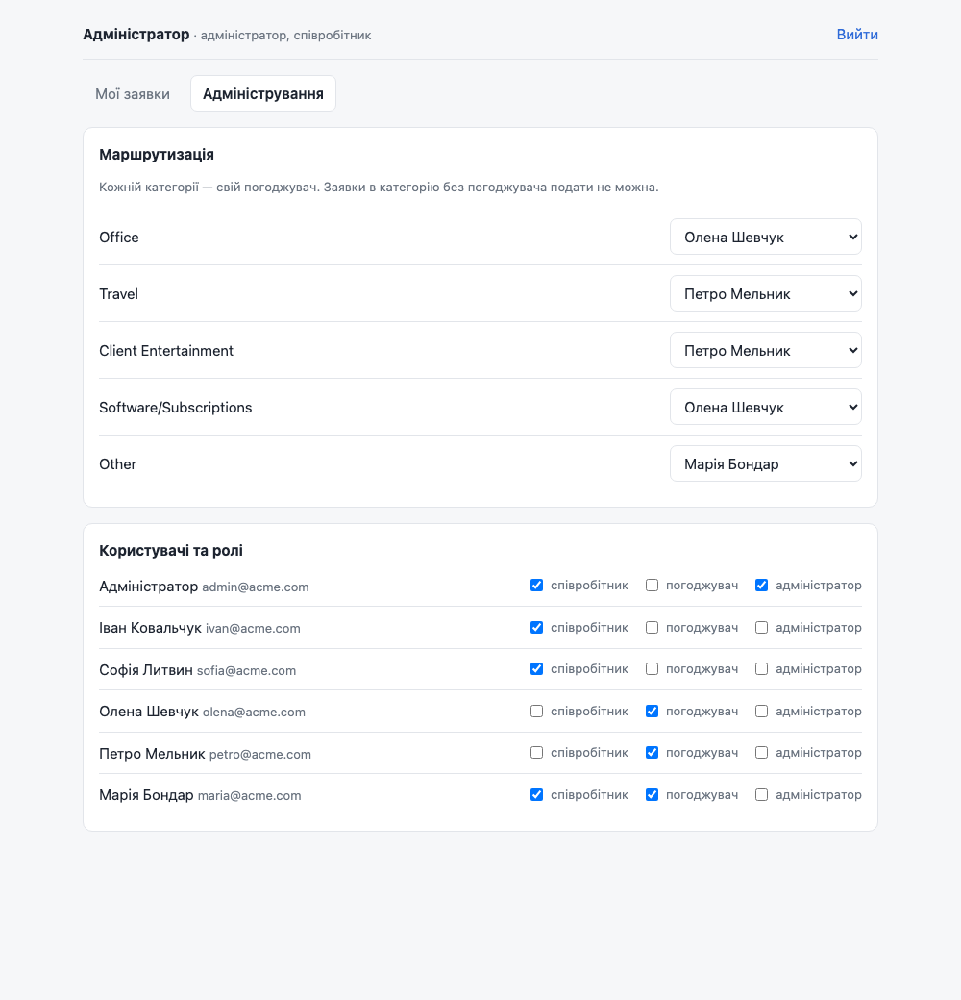

# Expense Approval

Сервіс узгодження заявок на відшкодування витрат.

Співробітник подає заявку → вона сама йде до погоджувача, відповідального за цю
категорію → погоджувач ухвалює або відхиляє → заявник бачить статус у себе на
сторінці. Коли погоджувач відкриває заявку, AI коротко описує її та підсвічує,
якщо сума, категорія й опис не сходяться.

---

## Запуск

Потрібен лише **Docker**.

```bash
docker compose up
```

Усе інше станеться само: підніметься база, створяться таблиці, наповняться
тестові дані, запуститься застосунок.

Коли в консолі побачите `Application startup complete` — відкривайте:

### 👉 http://127.0.0.1:8010

> Порт 8010, бо 8000 часто вже чимось зайнятий.
> Щоб AI-підказка працювала, покладіть ключ у файл `.env`:
> `OPENAI_API_KEY=sk-...` (без ключа все інше працює як звичайно).

Щоб зупинити — `Ctrl+C`. Щоб почати з чистого аркуша — `docker compose down -v`.

---

## Акаунти для входу

Пароль у всіх однаковий: **`demo12345`**

| Увійдіть як | Email | Що побачите |
|---|---|---|
| **Співробітник** | `ivan@acme.com` | свої заявки, форма подачі |
| **Погоджувач** | `olena@acme.com` | чергу на погодження (Office, Software) |
| Другий погоджувач | `petro@acme.com` | чергу (Travel, Client Entertainment) |
| **Обидві ролі разом** | `maria@acme.com` | і свої заявки, і свою чергу |
| **Адміністратор** | `admin@acme.com` | керування ролями й маршрутизацією |



---

## Як потестувати

Найзручніше у **двох вікнах браузера** — звичайному і приватному. Тоді ви
одночасно і заявник, і погоджувач, і видно, як статус змінюється сам.

### 1. Подивіться на заявки співробітника

Увійдіть як `ivan@acme.com`. Заявки розділені на дві групи: **«Очікують
рішення»** і **«Вже розглянуті»** — щоб не шукати очима, де що. Під відхиленою
заявкою видно коментар погоджувача.



### 2. Подайте нову заявку

Натисніть «Подати нову заявку». Під полем категорії видно, **хто її
погоджуватиме** — ще до відправлення.



Спробуйте подати щось у категорії, яку ще нікому не призначили — така опція
в списку сіра й недоступна. Заявка не може зависнути без адресата.

### 3. Відкликайте заявку

Кнопка «Відкликати» є лише на тих заявках, які ще ніхто не розглянув. Після
рішення погоджувача вона зникає.

### 4. Тепер станьте погоджувачем

У другому вікні увійдіть як `olena@acme.com`. У вкладці «Черга на погодження» —
**лише її** заявки, і теж двома групами: спершу **«Потребують вашого
рішення»**, нижче — **«Вже розглянуті»**. Лічильник на вкладці показує тільки
те, що чекає рішення.



### 5. Спробуйте відхилити без коментаря

Клікніть на заявку, натисніть «Відхилити», не заповнивши поле коментаря.
Не вийде — система попросить пояснення. Це навмисно: відхилення без причини
не проходить ні через інтерфейс, ні через API, ні навіть напряму в базі.

### 6. Подивіться на AI-підказку

Відкрийте заявку **$480 · Office · «Квиток на літак до Лондона»**. AI опише
заявку одним реченням і підніме прапорець: авіаквиток — це Travel, а не Office.



Зверніть увагу на три речі:

- кнопки «Погодити» і «Відхилити» активні **одразу**, ще поки AI думає;
- AI не радить, що робити — лише описує й показує сумнів;
- вимкніть інтернет або приберіть ключ — замість підказки буде рядок
  «рішення ухвалюєте ви — це нічого не блокує», і заявку все одно можна
  погодити.

Для порівняння відкрийте звичайну заявку (наприклад, офісні лампи) —
там буде тільки опис, без прапорця.

### 7. Ухваліть рішення й подивіться в перше вікно

**Нічого не натискайте** — за кілька секунд статус заявки в Івана зміниться сам,
а під нею з'явиться ваш коментар.

### 8. Загляньте в адмінку

Увійдіть як `admin@acme.com` → вкладка «Адміністрування». Тут видно, яка
категорія до кого йде, і можна це змінити. Нижче — ролі всіх користувачів.



Спробуйте перекинути категорію `Office` на Петра — і подайте нову заявку
в цій категорії. Вона піде вже йому.

### 9. Переконайтеся, що чужі заявки недоступні

Увійдіть як `sofia@acme.com` і відкрийте `http://127.0.0.1:8010/api/claims/1`.
У відповідь — `404`, ніби такої заявки не існує. Хоча Іван її бачить.

---

## Якщо щось пішло не так

**Кнопка «Увійти» не реагує** — у браузері лишилась стара версія сторінки.
Оновіть із `Cmd+Shift+R` (або `Ctrl+Shift+R`).

**«Забагато невдалих спроб»** — після 5 невірних паролів вхід блокується на
15 хвилин. Щоб не чекати:

```bash
docker compose exec db psql -U expense -d expense_approval -c "DELETE FROM login_attempts;"
```

**Забули пароль / хочете свій акаунт:**

```bash
docker compose exec app python -m app.cli list-users
docker compose exec app python -m app.cli set-password --email ivan@acme.com
docker compose exec app python -m app.cli create-admin --email ви@company.com --name "Ваше ім'я"
```

**Порт 8010 зайнятий** — змініть у `docker-compose.yml` рядок `"8010:8000"`
на, скажімо, `"8020:8000"`.

---

## Автоматичні тести

```bash
docker compose up -d                        # потрібна лише база
python3 -m venv .venv && source .venv/bin/activate
pip install -r requirements.txt
pytest -q                                   # 48 тестів
```

Тести створюють собі окрему базу, проганяються в ній і прибирають її за собою —
ваші дані не зачіпаються.

Перевіряють те, що найлегше зламати: маршрутизацію за категоріями, доступ до
чужих заявок, обов'язковий коментар при відхиленні, відкликання лише до
рішення, права адміністратора, протухання сесій, блокування після невдалих
спроб входу, пагінацію і те, що зламаний AI не блокує погоджувача.

---

## Технічні деталі

FastAPI + PostgreSQL (SQLAlchemy 2.0 + Alembic) + HTML/JS без збірки.

```
app/
  main.py     роути й бізнес-правила
  models.py   моделі бази
  schemas.py  валідація вхідних даних
  auth.py     паролі, сесії, ролі, захист входу
  ai.py       AI-підказка для погоджувача
  errors.py   переклад помилок валідації
  demo.py     тестові дані
  cli.py      консольні команди
alembic/      міграції
static/       фронтенд
tests/
```

**Ролі.** `employee` подає заявки, `approver` ухвалює рішення, `admin` керує
ролями й маршрутизацією. Ролі не виключні — одна людина може бути і
співробітником, і погоджувачем.

**Статуси.** `pending → approved | rejected | withdrawn`. Рішення остаточне;
рядок заявки блокується через `SELECT ... FOR UPDATE`, щоб два одночасні
рішення не розійшлися.

**Що винесено на рівень бази** — щоб трималось навіть в обхід застосунку:
сума як `NUMERIC(12,2)` замість float, `CHECK` на додатну суму, `CHECK`, що
не дає зберегти відхилену заявку без коментаря, справжні PostgreSQL-енами для
категорій і статусів, `ON DELETE RESTRICT` на заявках.

**Доступ.** Заявку бачать рівно двоє: автор і призначений погоджувач.
Стороннім — `404`, а не `403`, щоб не підтверджувати існування заявки.

**Вхід.** Пароль — PBKDF2-HMAC-SHA256, 200 000 ітерацій із сіллю. Сесія —
токен у `httponly`-кукі, живе 7 днів. 5 невдалих спроб на email за 15 хвилин →
`429`.

**Маршрутизація.** Таблиця `category_approvers`, якою керує адміністратор.
Якщо погоджувач сам подає заявку у «свою» категорію, вона йде до іншого —
сам себе ніхто не погоджує. І не можна зняти роль погоджувача з людини, на
якій ще висять категорії: спершу треба передати їх комусь іншому.

**Два списки.** І заявник, і погоджувач бачать нерозглянуті заявки окремо від
завершених — це параметр `?state=pending|decided` на `/api/claims/mine` і
`/api/claims/queue`. Кожна група гортається окремо, по 20 штук.

**«Реальний час».** Сторінка тихо опитує сервер раз на 4 секунди. Для MVP
цього достатньо, WebSocket був би зайвою складністю.

**AI.** Промпт — англійською, зі структурою `<task>` / `<categories>` /
`<how_to_decide_the_flag>` / `<rules>` / `<examples>` / `<output_format>`,
відповідь строго JSON; текст підказки модель пише мовою опису заявки.
Ендпоїнт **завжди повертає 200** — немає ключа, впав OpenAI, вийшов таймаут
(8 с) → приходить `{"available": false, "reason": "..."}`. Результат
кешується в таблиці `ai_reviews`, тож модель смикається раз на заявку.
Модель за замовчуванням `gpt-4o-mini`, змінюється через `OPENAI_MODEL`.

**Налаштування** (`.env`, усі необов'язкові, окрім ключа для AI):
`OPENAI_API_KEY`, `OPENAI_MODEL`, `AI_TIMEOUT`, `SESSION_TTL_DAYS`,
`MAX_LOGIN_ATTEMPTS`, `LOGIN_WINDOW_MINUTES`, `DATABASE_URL`.

**Поза межами MVP:** відновлення пароля, вкладення чеків, історія змін заявки,
конвертація валют (усе в USD), email-сповіщення.
